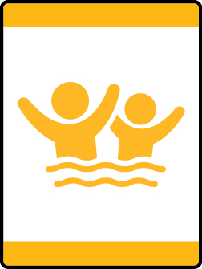
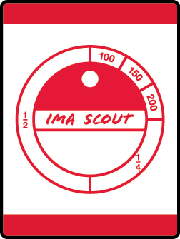
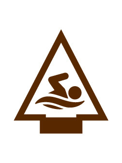

# Mahomet Cub Scout Pack 25

Cub Scout Pack 25 in Mahomet, Illinois was formed on November 30, 1947* and is chartered by the [Mahomet-Seymour Parent Teacher Organization](https://m-spto.org/).  We are a member of the [Prairielands Council](https://prairielandsbsa.org/) within [Scouting America](https://beascout.scouting.org/units/b4d51b2c-d46c-4c83-80b0-9cc7ed9334b0).

We welcome *ALL* youth in grades K-5 and meet regularly for fun, adventure, and learning — building character, citizenship, and
confidence in youth.

## Upcoming Events

### Family Swim Adventure - Monday, August 24th 6-8pm

Bring your family (yes, parents and siblings can participate!) and join us at Sholem Aquatic Center to work on your Scout's Swimming Adventure!  See more details on necessary health forms and sign up RSVP here: [Swim Adventure Details](swim-adventure-2026.md)

To see the swim requirements for your Scout - see the links below:

| Loop/Pin | Adventure Name | Grade | Rank |
| --- | --- | --- | --- |
|  | [Time to Swim](https://www.scouting.org/cub-scout-adventures/time-to-swim/) | K | Lion |
|  | [Tigers in the Water](https://www.scouting.org/cub-scout-adventures/tigers-in-the-water/) | 1st | Tiger |
|  | [Paws for Water](https://www.scouting.org/cub-scout-adventures/paws-for-water/) | 2nd | Wolf |
|  | [Salmon Run](https://www.scouting.org/cub-scout-adventures/salmon-run/) | 3rd | Bear |
|  | [Aquanaut](https://www.scouting.org/cub-scout-adventures/aquanaut/) | 4th | Webelos |
|  | [Swimming](https://www.scouting.org/cub-scout-adventures/swimming/) | 5th | Arrow of Light |

## Fall 2026 Registration

See our [General Info Flyer](forms/General_Info-Flyer_2026-2027.pdf) and join us for our "New Parent Info & Registration Night" on August 17, 2026 at 6:30 PM at the Lincoln Trail Elementary School Cafeteria. Come meet our leaders, ask questions, and see why Cub Scouts is the perfect fit for your child. Children do not need to attend, but are welcome to. If you are not able to attend, message us on [Facebook](https://www.facebook.com/MahometCubScoutPack25) or reach out via email below.

## General Info & Regular Events

- **Pack (large group) Meeting** — Second Monday of every month, 6:30 PM @ Lincoln Trail Elementary
- **Den (small group) Meetings** - Meet 1 Monday per month, see [Calendar](https://docs.google.com/document/d/1j6GQlqhVlV4vXsdT0PjQYu6UFg10sqST7merEAVw3II) for specific dates
- Swimming Adventure - August
- Fall Campout at [Camp Drake](https://www.campdrake.com/) - great for beginners!
- **Popcorn Fundraiser** — September/October
- Bicycle Rodeo
- Pinewood Derby - February (Make and Race your own car!)
- Spring Campout at TBD (generally IL State Park)
- and MUCH MORE!

For all events, see [Calendar](https://docs.google.com/document/d/1j6GQlqhVlV4vXsdT0PjQYu6UFg10sqST7merEAVw3II) for specific details.

## New Families / Questions?

New Scouts are welcome to join at ANY time of year. Interested in joining or have questions? E-mail: **DavidTsukuno@gmail.com**

------

<small>*[History of Mahomet](https://libsysdigi.library.illinois.edu/oca/Books2008-06/historyofmahomet00purn/historyofmahomet00purn.pdf) (Page 53)</small>
